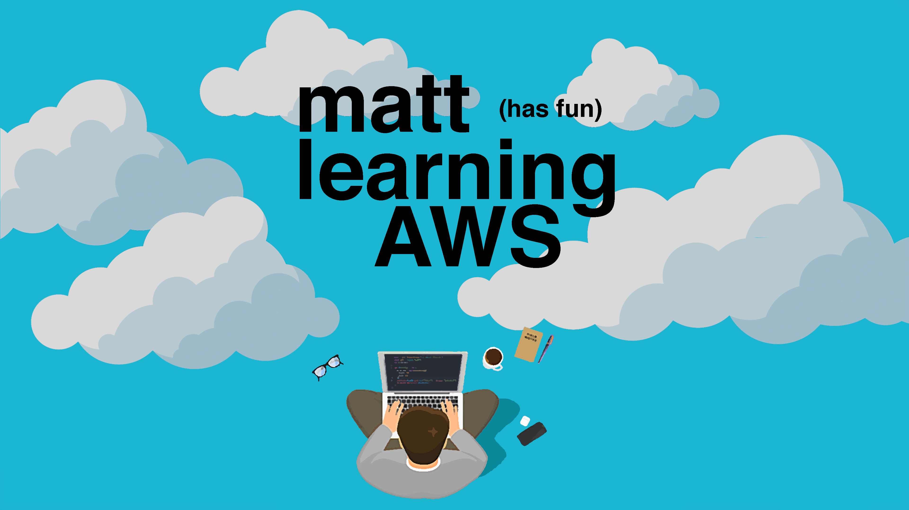

## What?
It's a collection of [AWS](https://aws.amazon.com/) topics I am or have studied.

### What AWS certificates are available?

__As of 2019-12-01__

### Which certificates have I completed?
- [x] - [AWS Certified Solutions Architect – Associate](./aws-certified-solutions-architect–associate/index.md)
